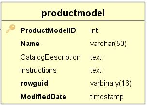
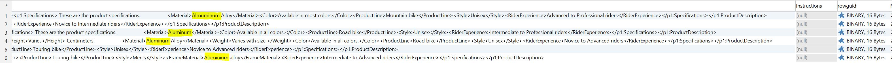
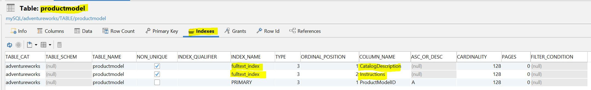
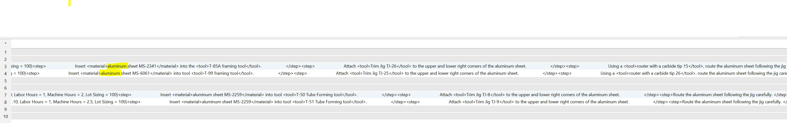
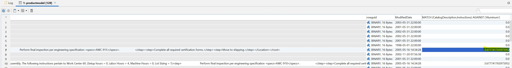

<h1 align="center">ДЗ 15</h1>
<h1 align="center">MySQL index</h1>

---
### Create database ###
```bash
1)
Скачать базу https://github.com/tapsey/AdventureWorksMYSQL
2)
mysql -u root -p AdventureWorks < AdventureWorks-MySQL-with-FKs.sql
```

Полнотекстовый индекс(FULLTEXT) и может быть наложен на поля CHAR, VARCHAR и TEXT.
Загрузка данных в таблицу, уже имеющую индекс FULLTEXT, будет более медленной

| исходная таблица |  |
| ---------------- | -------------- |

### Fulltext index ###
```sql
--Нечеткий запрос в базе данных заключается в использовании ключевого слова like для запроса
SELECT * FROM productmodel
WHERE CatalogDescription LIKE '%Aluminum%';
```

```sql
--Добавим fulltext index на два позволя
ALTER TABLE productmodel ADD FULLTEXT INDEX fulltext_index(CatalogDescription,Instructions);
```

``Функция MATCH() выполняет поиск в естественном языке, сравнивая строку с содержимым текста (совокупность одного или более столбцов, включенных в индекс FULLTEXT). Строка поиска задается как аргумент в выражении AGAINST(). Поиск выполняется без учета регистра символов. Для каждой строки столбца в заданной таблице команда MATCH() возвращает величину релевантности, т.е. степень сходства между строкой поиска и текстом, содержащимся в данной строке указанного в списке оператора MATCH() столбца.``

``Когда команда MATCH() используется в выражении WHERE (см. пример выше), возвращенные строки столбцов автоматически сортируются, начиная с наиболее релевантных. Величина релевантности представляет собой неотрицательное число с плавающей точкой. Релевантность вычисляется на основе количества слов в данной строке столбца, количества уникальных слов в этой строке, общего количества слов в тексте и числа документов (строк), содержащих отдельное слово.``
```sql
SELECT * FROM productmodel
WHERE MATCH (CatalogDescription,Instructions) AGAINST ('Aluminum');
--Если построили по двум полям, то и в поиске указывает два поля
```


```sql
SELECT *,MATCH (CatalogDescription,Instructions) AGAINST ('Aluminum') FROM productmodel;
--возвращает величину релевантности, т.е. степень сходства между строкой поиска и текстом, содержащимся в данной строке указанного в списке оператора MATCH() столбца, чем больше цифра, тем больше совпадений в строке
```



| Database   | ver    |
| -----      | ---    |
| MySQL      | 8.0.15 |
